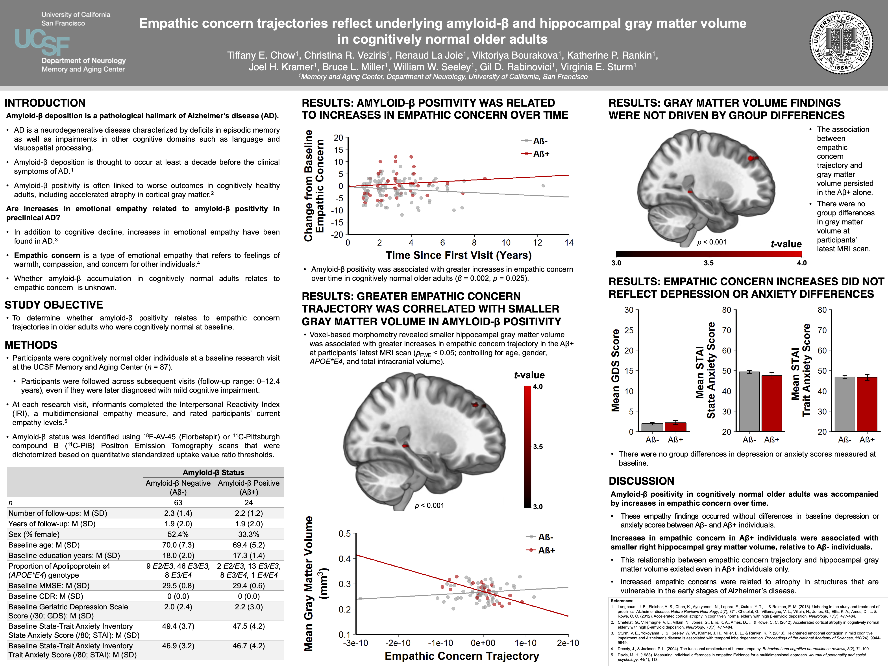

# Empathic Concern Trajectories Reflect Underlying Amyloid-β and Hippocampal Gray Matter Volume in Cognitively Normal Older Adults

**Poster Presentation** | Society for Neuroscience (SfN) Annual Meeting | 2019 | Chicago, IL, USA

**Core Skills:** `R` `MATLAB` `Mixed-Effects Regression` `Feature Extraction` `Longitudinal Trajectory Modeling` `Voxel-Based Morphometry (VBM)` `PET` `MRI`

---

## Executive Summary

*   **Problem:** While Amyloid-β (Aβ) plaques may begin accumulating in the brain decades before clinical Alzheimer's disease (AD) is diagnosed, symptomatic patients with this neurodegenerative disorder often present with heightened emotional empathy. It is unknown whether abnormal Aβ aggregation triggers similar socioemotional changes in healthy older adults, and how these early behavioral shifts may reveal corresponding structural brain vulnerabilities, particularly in memory-processing regions like the hippocampus. *Do preclinical AD biomarkers foreshadow long-term changes in behavior and brain structures in asymptomatic adults?*
*   **Approach:** Examined 87 cognitively normal older adults enrolled in a longitudinal aging study with follow-ups spanning up to 12.4 years. Participants were divided into positive Aβ (Aβ+; *n* = 24) and negative Aβ (Aβ-; *n* = 63) groups using molecular Positron Emission Tomography (PET) imaging. Assessed longitudinal group differences in informant-based emotional empathy ratings with multivariate mixed-effects regressions, extracting individual participant slopes to investigate the relationship between these longitudinal empathy trajectories and gray matter volume using voxel-based morphometry (VBM).
*   **Takeaway:** Early AD pathology reflects socioemotional changes and accompanying structural neuroanatomy differences in cognitively normal individuals. The Aβ+ group demonstrated a **significant longitudinal increase in emotional empathy**, a behavioral shift that occurred *independently of mood differences*, and these steeper empathy gains were directly associated with **smaller right hippocampal gray matter volume**. These results suggest that *preclinical behavioral shifts may occur before cognitive decline* is clinically detected.

---

## Technical Methodologies
*As the lead researcher and first author, I conducted the end-to-end analytical pipeline:*

*   **Data Wrangling:** Investigated the core research question and operationalized the analytical design, curating the dataset by defining inclusion criteria and aggregating a multi-modal dataset spanning neuroimaging, genetic, and behavioral metrics.
*   **Statistical Modeling & Feature Extraction:** Designed and implemented a cohort stratification analysis pipeline, utilizing **R** to develop cross-sectional multivariate mixed-effects regressions and longitudinal trajectory models and to extract individual participant slopes as engineered features, followed by voxel-based morphometry (VBM) neuroimaging analyses in **MATLAB**.
*   **Data Visualization:** Developed data visualizations to translate complex findings into accessible formats and authored the presentation materials.

---

---

## Funding Acknowledgment

This study was supported by the Larry L. Hillblom Foundation, the John Douglas French Alzheimer’s Foundation, and grants from the National Institute on Aging (P30 AG062422, K23AG040127, K99AG065501, R01AG057204, and R01AG073244).

---
**Keywords:** *Magnetic Resonance Imaging (MRI), Positron Emission Tomography (PET), Voxel-Based Morphometry (VBM), Structural Neuroimaging, Mixed-Effects Regression, Longitudinal Behavioral Modeling, Multivariate Linear Regression, Cohort Stratification, Gray Matter Volume, Hippocampus, Alzheimer's Disease, Amyloid-β, Apolipoprotein ɛ4 (APOE\*E4), Biomarker, Preclinical Marker, Neurodegenerative Disorder, Social Cognition, Emotional Empathy, Interpersonal Reactivity Index (IRI)*
