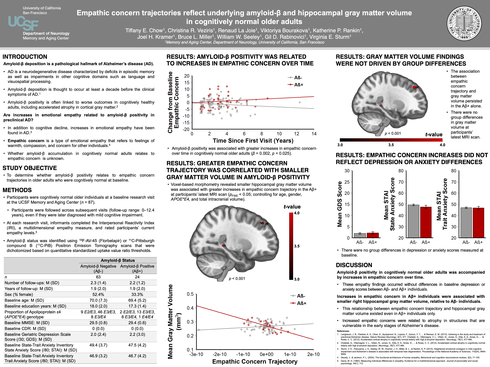

# Empathic Concern Trajectories Reflect Underlying Amyloid-β and Hippocampal Gray Matter Volume in Cognitively Normal Older Adults

**Poster Presentation** ([View Poster](./2019-chow-sfn.png)) | Society for Neuroscience (SfN) Annual Meeting | 2019 | Chicago, IL, USA

**Tools:** `R` `nlme` `MATLAB` `Statistical Parametric Mapping Toolbox (SPM12)` `Computational Anatomy Toolbox (CAT12)`

**Core Skills:** `Structural Neuroimaging (MRI)` `Voxel-Based Morphometry (VBM)` `Molecular PET Neuroimaging` `Linear Mixed-Effects Models` `Multivariate Linear Regression` `Longitudinal Trajectory Modeling` `Feature Engineering` `Cohort Stratification` `Multimodal Data Integration`

---

## Executive Summary

* **Problem:** Amyloid-β (Aβ) plaque accumulation begins decades before clinical Alzheimer's disease (AD) is diagnosed, yet symptomatic patients frequently present with heightened emotional empathy. Whether abnormal Aβ aggregation triggers similar socioemotional shifts in cognitively normal older adults, and how these behavioral changes relate to structural neurodegeneration in vulnerable memory structures like the hippocampus, remains unknown.
* **Approach:** Examined 87 cognitively normal older adults enrolled in a longitudinal aging study with follow-ups spanning up to 12.4 years. Participants were divided into positive Aβ (Aβ+; *n* = 24) and negative Aβ (Aβ-; *n* = 63) groups using molecular Positron Emission Tomography (PET) imaging. Assessed longitudinal group differences in informant-based emotional empathy ratings with multivariate mixed-effects regressions, extracting individual participant slopes to investigate the relationship between these longitudinal empathy trajectories and gray matter volume using voxel-based morphometry (VBM).
* **Takeaway:** Early AD pathology foreshadows long-term brain and behavior changes in asymptomatic, cognitively healthy older adults. The Aβ+ group demonstrated a **significant longitudinal increase in emotional empathy**, a behavioral shift that occurred *independently of mood differences*, and these steeper empathy gains were directly associated with **smaller right hippocampal gray matter volume**. These results suggest that *preclinical behavioral shifts may occur before cognitive decline* is clinically detected.

---

## Technical Methodologies
*As the lead researcher and first author, I conducted the end-to-end analytical pipeline:*

* **Data Wrangling:** Investigated the core research question and operationalized the analytical design, curating the dataset by defining inclusion criteria and aggregating a multi-modal dataset spanning neuroimaging, genetic, and behavioral metrics.
* **Statistical Modeling and Feature Extraction:** Designed and implemented a comparative analysis pipeline to evaluate neural and behavioral differences based on biomarker presence, utilizing **R** to develop cross-sectional multivariate mixed-effects regressions and longitudinal trajectory models and to extract individual participant slopes as engineered features, followed by voxel-based morphometry (VBM) neuroimaging analyses in **MATLAB**.
* **Data Visualization:** Developed data visualizations to translate complex findings into accessible formats and authored the presentation materials.

---

---

## Funding Acknowledgment

This study was supported by the Larry L. Hillblom Foundation, the John Douglas French Alzheimer’s Foundation, and grants from the National Institute on Aging (P30 AG062422, K23AG040127, K99AG065501, R01AG057204, and R01AG073244).

---

**Keywords:** *Magnetic Resonance Imaging (MRI), Positron Emission Tomography (PET), Voxel-Based Morphometry (VBM), Structural Neuroimaging, Mixed-Effects Regression, Feature Extraction, Feature Engineering, Longitudinal Behavioral Modeling, Multivariate Linear Regression, Cohort Stratification, Gray Matter Volume, Hippocampus, Multimodal Integration, Alzheimer's Disease, Amyloid-β, Apolipoprotein ɛ4 (APOE\*E4), Biomarker, Preclinical Marker, Neurodegenerative Disorder, Social Cognition, Emotional Empathy, Interpersonal Reactivity Index (IRI)*
