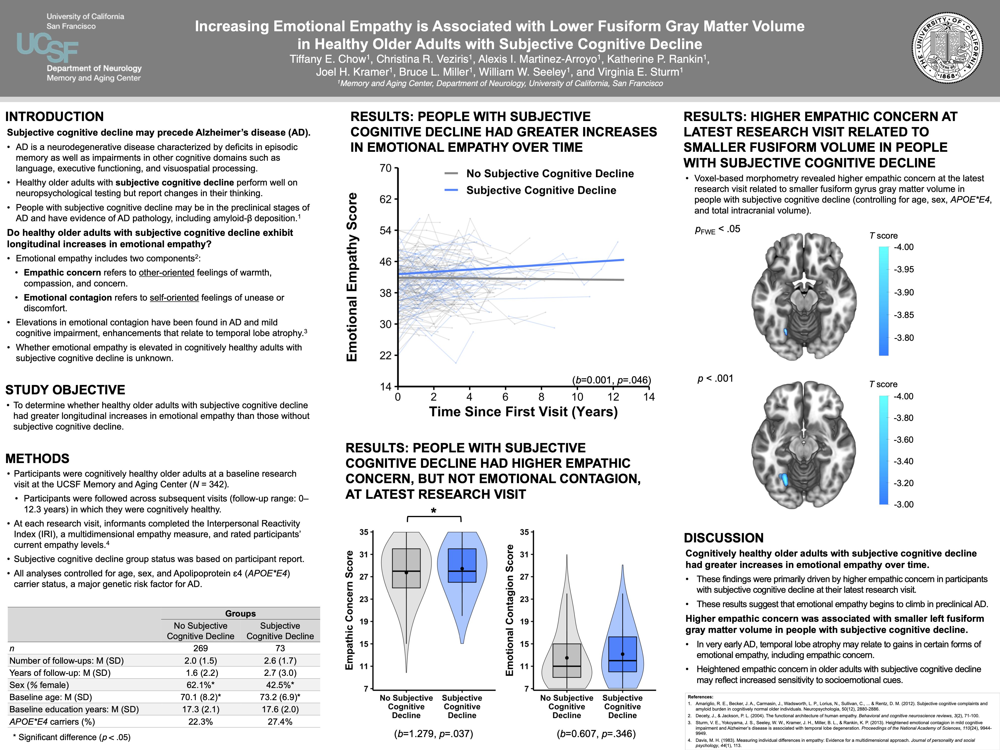

# Increasing Emotional Empathy is Associated with Lower Fusiform Gray Matter Volume in Healthy Older Adults with Subjective Cognitive Decline

**Digital Presentation** | Society for Affective Science (SAS) | 2022 | Virtual

**Core Skills:** `R` `MATLAB` `Mixed-Effects Regression` `Longitudinal Analyses` `Voxel-Based Morphometry (VBM)` `MRI`

---

## Executive Summary

* **Problem:** Alzheimer's disease (AD) is a neurodegenerative disorder characterized by memory and other cognitive deficits, but patients also commonly experience alterations in socioemotional processing, such as elevated emotional empathy. *Subjective cognitive decline (SCD) may represent a preclinical stage of AD* where individuals report worsening cognition despite normal performance on clinical neuropsychological tests. Whether these asymptomatic individuals also experience the socioemotional changes present in later disease stages has not been studied.
* **Approach:** Evaluated a large sample of cognitively healthy older adults (*n* = 342) participating in a longitudinal study, subsequently stratified into an SCD group (*n* = 73) and a non-SCD control group (*n* = 269) based on self-reported cognitive changes. Assessed *longitudinal group differences* in informant-rated empathy and evaluated the *structural neuroanatomical correlates of these empathy trajectories* in the SCD group with voxel-based morphometry (VBM).
* **Takeaway:** Subjective cognitive decline involves both increasing emotional empathy and accompanying neuroanatomical differences. Individuals reporting SCD demonstrated a **steeper longitudinal rise in emotional empathy** compared to those without cognitive complaints, which directly predicted **reduced gray matter volume in the left fusiform gyrus**, a temporal lobe region vulnerable in early AD. These findings suggest that growing socioemotional sensitivity, potentially driven by localized brain atrophy, may serve as a *preclinical marker of AD emerging prior to cognitive symptoms*.

---

## Technical Methodologies
*As the lead researcher and first author, I conducted the end-to-end analytical pipeline:*
*   **Data Wrangling:** Investigated the core research question and operationalized the analytical design, curating the dataset by defining inclusion criteria and aggregating a multi-modal dataset spanning neuroimaging, genetic, and behavioral metrics.
*   **Statistical Modeling:** Designed and implemented a cohort stratification analysis pipeline, developing multivariate mixed-model regressions in **R**, and conducting neuroimaging analyses in **MATLAB**.
*   **Data Visualization:** Developed data visualizations to translate complex findings into accessible formats and authored the presentation materials.

---

---
**Keywords:** *Magnetic Resonance Imaging (MRI), Voxel-Based Morphometry (VBM), Behavioral Modeling, Neuroimaging Analyses, Longitudinal Analyses, Mixed-Effects Modeling, Multivariate Linear Regression, Gray Matter Volume, Fusiform Gyrus, Subjective Cognitive Decline (SCD), Alzheimer's Disease, Apolipoprotein ɛ4 (APOE\*E4), Neurodegenerative Disorder, Preclinical Marker, Social Cognition, Emotional Empathy, Interpersonal Reactivity Index (IRI)*
